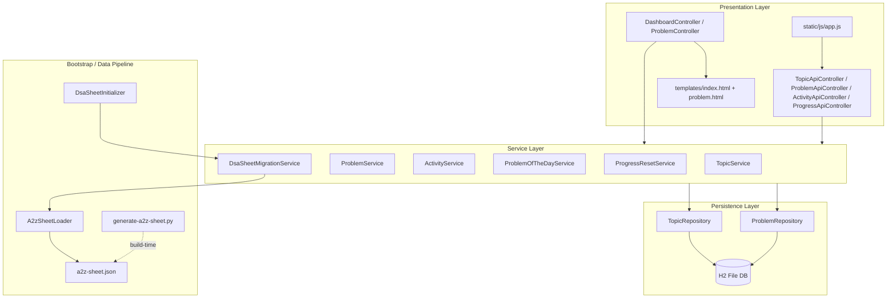
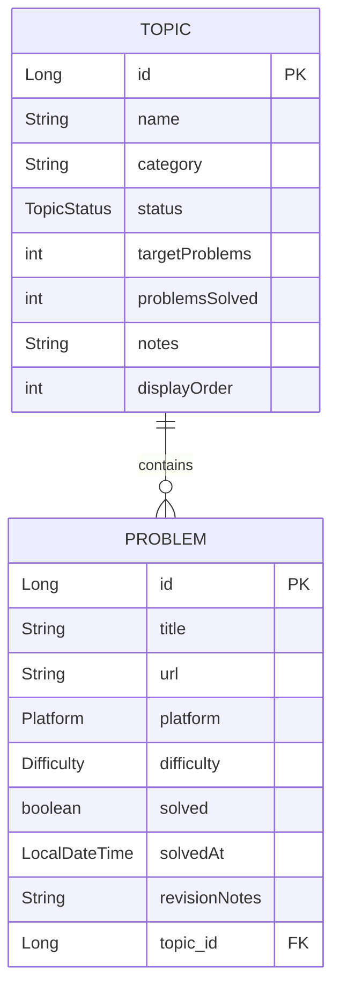
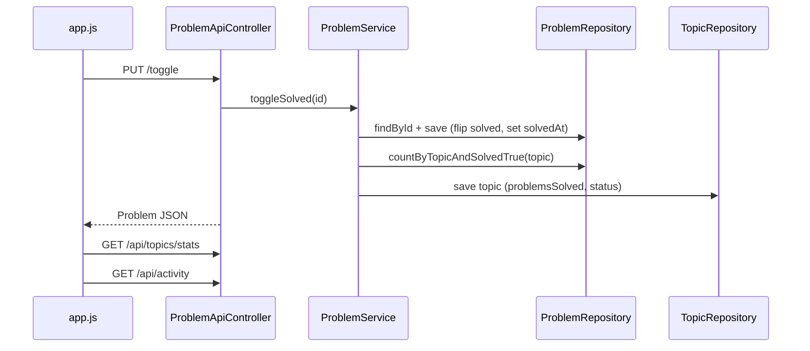

# DSA Tracker — Low-Level Design

Architecture, data flows, and design tradeoffs for the **dsa-tracker** Spring Boot application. For setup and run instructions, see [README.md](README.md).

---

## What This System Is

**dsa-tracker** is a single-user, local-first web app for tracking progress through Striver's **A2Z DSA Sheet** (~409 problems across 18 topics). It is a Spring Boot 3.4.1 monolith (Java 21) with:

- **H2** file-backed database (`./data/dsa-tracker`)
- **Thymeleaf** server-side rendering for the dashboard
- **Vanilla JS** + REST APIs for interactive updates (toggle solved, notes, reset)
- **No auth**, no multi-tenancy, no migration framework (Flyway/Liquibase)

The design optimizes for **simplicity and correctness on a small, fixed dataset** — not horizontal scale or multi-user concurrency.

---

## Layered Architecture



### Layer responsibilities

| Layer | Location | Role |
|-------|----------|------|
| **Controllers** | `src/main/java/com/dsatracker/controller/` | Route HTTP; MVC controllers populate Thymeleaf models; REST controllers return JSON |
| **Services** | `src/main/java/com/dsatracker/service/` | Business rules, transactions, aggregation |
| **Repositories** | `src/main/java/com/dsatracker/repository/` | Spring Data JPA queries |
| **Models** | `src/main/java/com/dsatracker/model/` | JPA entities + enums |
| **DTOs** | `src/main/java/com/dsatracker/dto/` | API/view shapes (`DashboardStats`, `ActivityStats`, request bodies) |
| **Config** | `src/main/java/com/dsatracker/config/` | Startup seeding via `CommandLineRunner` |

**Dependency rule:** Controllers never touch repositories directly. All DB access flows through services.

---

## Domain Model



### Key entity decisions

**Topic** (`src/main/java/com/dsatracker/model/Topic.java`):

- Owns a `@OneToMany` list of problems, ordered by `difficulty ASC, displayOrder ASC`
- Stores **denormalized** `problemsSolved` and `status` — not computed at read time
- `notes` field is **overloaded**: user-editable notes AND sheet version marker (`A2Z_SHEET_V5`) during seeding

**Problem** (`src/main/java/com/dsatracker/model/Problem.java`):

- `@ManyToOne` to Topic with **LAZY** fetch; `@JsonIgnore` on topic prevents JSON serialization loops
- User-mutable: `solved`, `solvedAt`, `revisionNotes`
- Seed-mutable: `title`, `url`, `platform`, `difficulty`

**Enums:** `Difficulty`, `Platform`, `TopicStatus` — stored as strings in DB for readability.

---

## API Surface

### Server-rendered pages

| Method | Path | Handler | Description |
|--------|------|---------|-------------|
| GET | `/` | `DashboardController` | Main dashboard: stats, heatmap, problem of the day, topic accordions |
| GET | `/problems/{id}` | `ProblemController` | Problem detail page with revision notes |

### REST endpoints

| Method | Path | Description |
|--------|------|-------------|
| GET | `/api/topics` | All topics with nested problems (eager-loaded) |
| GET | `/api/topics/stats` | Aggregate progress metrics |
| PUT | `/api/topics/{id}` | Update status, target, notes, difficulty |
| PUT | `/api/problems/{id}/toggle` | Toggle solved; sets/clears `solvedAt`; syncs topic |
| PUT | `/api/problems/{id}/revision-notes` | Save user revision notes |
| GET | `/api/activity` | 26-week heatmap + current/longest streak |
| POST | `/api/progress/reset` | Reset all solved state, revision notes, topic status |

### Error handling

- `IllegalArgumentException` → **404** `{"error": "..."}`
- `MethodArgumentNotValidException` → **400** `{"error": "field: message"}`

---

## Core Request Flows

### 1. Application startup (data lifecycle)

`DsaSheetInitializer` runs on every boot:

```
needsReseed()?  ──yes──> reseed()          [drop schema, recreate, insert all from JSON]
                ──no───> clearSeededNotes() + syncLinksFromSheet()
```

**`needsReseed()`** (`DsaSheetMigrationService`) returns true when:

- Topic count != JSON topic count
- Problem count != JSON problem count
- No topic has `notes == "A2Z_SHEET_V5"`

**`reseed()`** uses Hibernate `SchemaManager` to drop and recreate all tables, then inserts topics/problems row-by-row. **All user progress is lost** on reseed.

**`syncLinksFromSheet()`** (normal boot): title-matches existing problems to JSON and updates `url`/`platform` only — non-destructive.

#### Data pipeline

```
strivers-a2z-official.json  ─┐
a2zdsa-links.json           ─┼─► generate-a2z-sheet.py ─► a2z-sheet.json
a2z-link-overrides.json     ─┘         (build-time)
                                              │
                                              ▼
                                    A2zSheetLoader (classpath)
                                              │
                                              ▼
                              DsaSheetMigrationService.reseed()
```

| File | Purpose |
|------|---------|
| `a2z-sheet.json` | Canonical seed — 18 topics, ~409 problems (version `A2Z_SHEET_V5`) |
| `strivers-a2z-official.json` | Official sheet structure for generator |
| `a2zdsa-links.json` | Cached link lookups |
| `a2z-link-overrides.json` | Manual URL overrides by problem title |

### 2. Dashboard page load (`GET /`)

`DashboardController` orchestrates four service calls:

1. `topicService.getAllTopics()` — all topics + problems (eager via `@EntityGraph`)
2. `topicService.getDashboardStats()` — calls `getAllTopics()` **again** + 3 status count queries
3. `activityService.getActivityStats()` — loads all solved problems, builds 26-week heatmap
4. `problemOfTheDayService.getToday()` — `findAll()` + deterministic random pick

Thymeleaf renders the full sheet into HTML; client-side pagination shows 5 problems per difficulty section.

### 3. Toggle problem solved (`PUT /api/problems/{id}/toggle`)



Progress sync logic in `ProblemService.syncTopicProgress`:

- `COMPLETED` if solved >= target
- `IN_PROGRESS` if solved > 0
- `NOT_STARTED` otherwise

---

## Tradeoffs and Optimization Decisions

### 1. Hybrid SSR + selective REST (not SPA)

**Decision:** Thymeleaf renders the full dashboard on first load; JS only calls REST for mutations and partial refreshes.

| Benefit | Cost |
|---------|------|
| Fast first paint, no JS framework | Large initial HTML (~400 problems in DOM) |
| Simple mental model, no build toolchain | Full page reload on reset |
| Works offline after first load (static assets) | Search/filter/pagination are client-only on pre-rendered DOM |

**Why:** Personal tracker on localhost; complexity of React/Vue not justified.

---

### 2. Denormalized topic progress

**Decision:** `Topic.problemsSolved` and `Topic.status` are written on every toggle, not computed via `COUNT(*)` at dashboard render.

```java
// ProblemService.syncTopicProgress
int solvedCount = (int) problemRepository.countByTopicAndSolvedTrue(topic);
topic.setProblemsSolved(solvedCount);
// COMPLETED / IN_PROGRESS / NOT_STARTED based on solvedCount vs target
topicRepository.save(topic);
```

| Benefit | Cost |
|---------|------|
| O(1) read of progress per topic on dashboard | Must keep in sync on every mutation path |
| Status available without joining problems | Two sync strategies: DB count (`ProblemService`) vs in-memory stream (`TopicService.updateTopic`) |

**Why:** Dashboard reads topics frequently; writes are infrequent toggles.

---

### 3. `@EntityGraph` for dashboard N+1 prevention

**Decision:** The main dashboard query eagerly fetches problems in one round-trip.

```java
// TopicRepository
@EntityGraph(attributePaths = "problems")
List<Topic> findAllByOrderByDisplayOrderAsc();
```

| Benefit | Cost |
|---------|------|
| Avoids N+1 lazy-load per topic | Always loads all problems even if only stats needed |
| Single optimized query for full sheet view | `syncLinksFromSheet()` does NOT use entity graph — potential N+1 on startup |

**Why:** Dashboard always needs the full topic+problem tree; this is the hot path.

---

### 4. LAZY fetch on `Problem.topic` elsewhere

**Decision:** Problem-to-Topic is lazy; explicitly initialized only when needed.

```java
// ProblemService.getProblem — force-init lazy proxy
problem.getTopic().getName();
```

| Benefit | Cost |
|---------|------|
| Toggle/notes endpoints don't load topic unless syncing | Easy to accidentally trigger lazy-load outside transaction |
| Smaller payloads on problem-only operations | `ProblemOfTheDayService` triggers one extra query for topic name |

---

### 5. Version-gated destructive reseed vs incremental link sync

**Decision:** No Flyway/Liquibase. Schema managed by `ddl-auto=update`; full reseed on version/count mismatch.

| Benefit | Cost |
|---------|------|
| Zero migration boilerplate for a personal app | User progress wiped when sheet version bumps |
| Link sync on normal boot is non-destructive | `Topic.notes` overloaded as version marker |
| Python pipeline curates data offline | Overrides require regenerating `a2z-sheet.json` |

**Data pipeline split:**

- **Build-time:** `scripts/generate-a2z-sheet.py` merges official sheet + link cache + overrides
- **Runtime:** Java only reads `a2z-sheet.json` from classpath

---

### 6. Bulk JPQL for reset, row-by-row for topic reset

**Decision:** `ProgressResetService` uses bulk `UPDATE` for problems but iterates topics individually.

| Benefit | Cost |
|---------|------|
| Two bulk queries wipe all problem state fast | Topic reset is N individual saves (could be one JPQL) |
| Transactional consistency | — |

**Why:** Bulk problem update is the expensive part (~409 rows); topic count is only 18.

---

### 7. Problem of the Day: deterministic `findAll()`

**Decision:** `ProblemOfTheDayService` loads all problems, picks via `Random(today.toEpochDay())`.

| Benefit | Cost |
|---------|------|
| Same problem for all tabs on a given day | Full table scan on every dashboard load |
| Trivial implementation, no cache infrastructure | — |

**Why:** 409 rows is negligible for a local app; no cache layer exists anywhere in the project.

---

### 8. Activity heatmap: in-memory aggregation

**Decision:** `ActivityService` loads all solved problems, aggregates by day in Java, builds 26-week grid.

| Benefit | Cost |
|---------|------|
| Simple date math, no SQL date grouping | Reloads all solved problems on every toggle (via JS `refreshActivity()`) |
| Streak logic is readable in plain Java | No incremental update |

**Why:** Solved count is small for a personal tracker; heatmap is a nice-to-have feature.

---

### 9. No caching, scheduling, or async

**Explicit non-decisions:**

- No `@Cacheable`, `@Scheduled`, `@Async`
- No Redis, no second-level cache
- `spring.thymeleaf.cache=false` (dev-friendly template reload)

| Benefit | Cost |
|---------|------|
| Minimal infrastructure, easy to reason about | Redundant DB reads (dashboard loads topics twice) |
| Always fresh data after mutations | Would not scale beyond single-user local use |

---

### 10. Entity-as-API-response

**Decision:** REST endpoints return JPA entities directly (`Problem`, `Topic`); `@JsonIgnore` prevents serialization issues.

| Benefit | Cost |
|---------|------|
| No DTO mapping boilerplate | API contract coupled to persistence schema |
| Fast to build | Entity changes break API consumers |

**Why:** Small, single-consumer API (the app's own `app.js`).

---

### 11. Client-side UX optimizations (frontend)

In `src/main/resources/static/js/app.js`:

- **Debounced** revision note saves (600ms) — reduces write API calls
- **Accordion collapse** — full DOM present but hidden
- **Pagination** (5 per section) — limits visible cards without server round-trips
- **Client-side search** — filters pre-rendered HTML
- **Partial refresh** after toggle — only stats + heatmap refetched, not full page

---

## Service Layer Map

| Service | Responsibility | Transactions |
|---------|----------------|--------------|
| `TopicService` | List topics, update metadata, dashboard aggregates | Write on `updateTopic` only |
| `ProblemService` | Get problem, toggle solved, save revision notes, sync topic progress | Read + write |
| `ProblemOfTheDayService` | Deterministic daily problem pick | Read-only |
| `ActivityService` | Heatmap + streak computation | None |
| `ProgressResetService` | Bulk wipe of solved state and notes | Write |
| `DsaSheetMigrationService` | Seed/reseed DB from JSON, sync links on startup | Write |

---

## Configuration

Key settings in `src/main/resources/application.properties`:

| Setting | Value | Implication |
|---------|-------|-------------|
| `spring.datasource.url` | `jdbc:h2:file:./data/dsa-tracker` | Persistent local file DB |
| `spring.jpa.hibernate.ddl-auto` | `update` | Schema auto-evolves; no migration tool |
| `spring.thymeleaf.cache` | `false` | Templates reloaded on every request |
| `server.port` | `8080` | Default local port |

---

## Summary: Design Philosophy

| Axis | Choice |
|------|--------|
| Scale target | Single user, ~400 rows, localhost |
| Persistence | H2 file DB, Hibernate `ddl-auto=update` |
| Data curation | Offline Python + versioned JSON seed |
| Read optimization | `@EntityGraph` on dashboard; denormalized topic progress |
| Write optimization | Bulk JPQL on reset; count query on toggle sync |
| Frontend | SSR-first, REST for mutations only |
| Intentionally skipped | Auth, caching, migrations, tests, response DTOs |

The codebase makes deliberate **simplicity-over-scale** tradeoffs. The one clearly optimized hot path is the dashboard topic+problem load via `@EntityGraph`. Everything else favors straightforward code over premature optimization — appropriate for a personal DSA tracker, but would need revisiting for multi-user or cloud deployment.

---

## Known Gaps

- No authentication (single-user local app assumption)
- Reseed drops schema — user progress lost on sheet version bumps
- `Topic.notes` overloaded (user notes vs version marker during seed)
- No automated tests (`src/test` absent)
- README API list is incomplete vs actual endpoints
